```mermaid
graph LR
    A[🎯 2025 Goals] --> B[📚 Master Deep Learning]
    A --> C[🌐 Contribute to OSS]
    A --> D[🚀 Launch SaaS Product]
    A --> E[📝 Write Tech Blog]
    
    B --> B1[Complete 5 ML Projects]
    C --> C1[100+ Contributions]
    D --> D1[Reach 1000 Users]
    E --> E1[Publish 20 Articles]
    
    style A fill:#bf91f3,stroke:#667eea,stroke-width:3px,color:#fff
    style B fill:#667eea,stroke:#bf91f3,stroke-width:2px,color:#fff
    style C fill:#667eea,stroke:#bf91f3,stroke-width:2px,color:#fff
    style D fill:#667eea,stroke:#bf91f3,stroke-width:2px,color:#fff
    style E fill:#667eea,stroke:#bf91f3,stroke-width:2px,color:#fff
```

<div align="center">
  <a href="#-about-me">About Me</a> •
  <a href="#-tech-stack">Tech Stack</a> •
  <a href="#-projects">Projects</a> •
  <a href="#-metrics">Metrics</a> •
  <a href="#-connect">Contact</a>
</div>

<br>

<div align="center">
  
  
  <br>
  
  <a href="https://git.io/typing-svg">
    
  </a>

  <br><br>

  <a href="https://github.com/U00A">
    
  </a>
  <a href="https://www.linkedin.com/in/ouanes-med-b46b62313/">
    
  </a>
  <a href="https://x.com/MedellelOu81359">
    
  </a>
  <a href="https://www.instagram.com/real.o1n">
    
  </a>

  <br><br>
  
  
  
  

</div>

<br>

<br>

<h2 align="center" id="-about-me">🧬 ABOUT ME</h2>

<div align="center">


### 🚀 Mission Statement

<blockquote>
<strong>"I bridge the gap between complex AI algorithms and intuitive user interfaces."</strong>
<br><br>
My mission is to build software that feels like magic—where cutting-edge technology meets seamless user experience. I believe in the power of AI to transform industries while keeping humans at the center of every solution.
</blockquote>

<br>

### 💫 WHO I AM

<table>
<tr>
<td align="center" width="20%">

<br>
<strong>Full Stack</strong>
<br>
<sub>Developer</sub>
</td>
<td align="center" width="20%">

<br>
<strong>AI/ML</strong>
<br>
<sub>Engineer</sub>
</td>
<td align="center" width="20%">

<br>
<strong>UI/UX</strong>
<br>
<sub>Designer</sub>
</td>
<td align="center" width="20%">

<br>
<strong>El Kala, Algeria</strong>
<br>
<sub>🇩🇿 Based in</sub>
</td>
<td align="center" width="20%">

<br>
<strong>Computer Science</strong>
<br>
<sub>Student</sub>
</td>
</tr>
</table>

<br>

### 🎯 WHAT I DO

<table>
<tr>
<td width="50%" valign="top">

#### 💻 Languages I Speak


#### 🎨 Frontend Arsenal


#### ⚙️ Backend Power


</td>
<td width="50%" valign="top">

#### 🤖 AI & Machine Learning


#### 🔧 DevOps & Tools


#### 📚 Currently Learning


</td>
</tr>
</table>

<br>

### 💡 Core Philosophy

<table>
<tr>
<td align="center" width="33%">

<br>
<strong>Clean Code</strong>
<br>
<sub>Readable, maintainable, elegant</sub>
</td>
<td align="center" width="33%">

<br>
<strong>Scalable Systems</strong>
<br>
<sub>Built for growth & performance</sub>
</td>
<td align="center" width="33%">

<br>
<strong>User-Centric Design</strong>
<br>
<sub>Empathy-driven experiences</sub>
</td>
</tr>
</table>

<br>

**Fun Fact:** *I teach computers to dream* 😴✨

</div>

<br>

<br>

<h2 align="center" id="-tech-stack">🛠️ TECH ARSENAL</h2>

<div align="center">

### 💻 Core Languages


### 🎨 Frontend Development


### ⚙️ Backend & Database


### 🤖 AI & Data Science

<br>


### 🔧 DevOps & Tools


</div>

<br>

<br>

<h2 align="center" id="-projects">🌟 FEATURED PROJECTS</h2>

<div align="center">
<table>
<tr>
<td width="50%" valign="top">

### 🤖 AI Smart Attendance System
*Enterprise-grade biometric platform powered by deep learning*

<div align="center">

</div>

**Revolutionary attendance tracking with cutting-edge AI**

#### 🔧 Tech Stack


#### ✨ Key Features
- ⚡ Real-time face detection & recognition
- 🎯 99.8% accuracy with anti-spoofing
- 📊 Automated attendance reporting
- 🔒 Multi-camera support & security
- 🚀 REST API integration

#### 📈 Impact Metrics
```
✅ 99.8%  → Recognition Accuracy
✅ 50%    → Faster Check-in
✅ 1000+  → Daily Active Users
✅ <100ms → Average Response
```

<a href="https://github.com/U00A">
  
</a>

</td>
<td width="50%" valign="top">

### 🌐 Personal Portfolio Website
*Modern showcase with stunning UI/UX design*

<div align="center">

</div>

**Dynamic portfolio that leaves a lasting impression**

#### 🔧 Tech Stack


#### ✨ Key Features
- 🎨 Custom animations & smooth transitions
- 📱 Fully responsive across all devices
- ⚡ Optimized for lightning-fast loading
- 🌙 Beautiful dark mode support
- 🎯 SEO optimized for discoverability

#### 🚀 Highlights
```
🚀 <1s     → Page Load Time
🎨 Modern  → UI/UX Design
📊 Dynamic → Interactive Sections
🌐 Mobile  → First Approach
```

<a href="https://github.com/U00A/personal_pf">
  
</a>

</td>
</tr>
</table>
</div>

<br>

<div align="center">

### 🛠️ MORE PROJECTS

<table>
<tr>
<td align="center" width="33%">


#### 🔄 Lang Converter
**Multi-language translator**


Fast and accurate language conversion tool for seamless translation

<a href="https://github.com/U00A/Lang_converter">

</a>

</td>
<td align="center" width="33%">


#### ✅ Task Manager
**Productivity tool**


Simple yet effective task management for organizing your daily workflow

<a href="https://github.com/U00A/task-manager">

</a>

</td>
<td align="center" width="33%">


#### ⏰ Wakey Wakey
**Smart alarm system**


Intelligent wake-up application with customizable alerts and features

<a href="https://github.com/U00A/wakey_wakey">

</a>

</td>
</tr>
<tr>
<td align="center" width="33%">


#### 📚 Library Manager
**Book management system**


Comprehensive library tracking system with cataloging and user management

<a href="https://github.com/U00A/Libraey_manager">

</a>

</td>
<td align="center" width="33%">


#### 💻 Custom Terminal
**CLI interface**


Custom command-line environment with enhanced functionality and features

<a href="https://github.com/U00A/terminal">

</a>

</td>
<td align="center" width="33%">


#### 🚀 More Coming Soon
**Stay tuned!**

Currently building amazing things...


</td>
</tr>
</table>

</div>

<br>

<br>

<h2 align="center" id="-metrics">📊 GITHUB ANALYTICS DASHBOARD</h2>

<div align="center">


</div>

<br>

<div align="center">

## 🎯 PERFORMANCE METRICS

<table>
<tr>
<td width="50%" valign="top">

<div align="center">

### 📈 GitHub Stats


</div>

</td>
<td width="50%" valign="top">

<div align="center">

### 🔥 Streak Stats


</div>

</td>
</tr>
</table>

</div>

<br>

<div align="center">

## 💻 CODING ACTIVITY


</div>

<br>

<div align="center">

## 🎨 TECHNOLOGY BREAKDOWN

<table>
<tr>
<td width="40%" align="center" valign="top">

### 📊 Top Languages


</td>
<td width="60%" align="center" valign="top">

### 📦 Repository Insights

<br>

<table>
<tr>
<td align="center" width="33%">
<br>
<br>
<sub>Active Projects</sub>
</td>
<td align="center" width="33%">
<br>
<br>
<sub>Community Love</sub>
</td>
<td align="center" width="33%">
<br>
<br>
<sub>Network Size</sub>
</td>
</tr>
</table>

<br>

**🗂️ Language Distribution**

<table>
<tr>
<td align="center" width="33%">
<br>
<strong>6 Projects</strong><br>
<sub>AI/ML & Automation</sub>
</td>
<td align="center" width="33%">
<br>
<strong>1 Project</strong><br>
<sub>Enterprise Systems</sub>
</td>
<td align="center" width="33%">
<br>
<strong>1 Project</strong><br>
<sub>System Programming</sub>
</td>
</tr>
</table>

</td>
</tr>
</table>

</div>

<br>

<div align="center">

## ⏱️ DEVELOPMENT INSIGHTS

<table>
<tr>
<td width="50%" align="center" valign="top">

### 🌙 Most Productive Hours


</td>
<td width="50%" align="center" valign="top">

### 📊 Commit Statistics


</td>
</tr>
</table>

</div>

<br>

<div align="center">

## 🎖️ DEVELOPER PROFILE SUMMARY

<table>
<tr>
<td align="center" width="20%">
<br>
<strong>Full Stack</strong><br>
<sub>Developer</sub>
</td>
<td align="center" width="20%">
<br>
<strong>AI/ML</strong><br>
<sub>Engineer</sub>
</td>
<td align="center" width="20%">
<br>
<strong>Open Source</strong><br>
<sub>Contributor</sub>
</td>
<td align="center" width="20%">
<br>
<strong>Multi-Language</strong><br>
<sub>Expert</sub>
</td>
<td align="center" width="20%">
<br>
<strong>Continuous</strong><br>
<sub>Learner</sub>
</td>
</tr>
</table>

<br>


</div>

<br>

<br>

<h2 align="center">🎯 2025 ROADMAP</h2>

<div align="center">



</div>

<br>

<br>

<h2 align="center">💼 WHAT I BRING TO THE TABLE</h2>

<div align="center">
<table>
<tr>
<td width="33%" align="center">


### Full Stack Development

Building scalable, high-performance web applications with modern frameworks and industry best practices

**Key Skills:**
- React & Next.js ecosystems
- Node.js backend architecture
- Database design & optimization
- RESTful API development

</td>
<td width="33%" align="center">


### AI/ML Engineering

Developing intelligent systems using deep learning, computer vision, and advanced machine learning techniques

**Key Skills:**
- TensorFlow & PyTorch
- Computer Vision (OpenCV)
- Model deployment & optimization
- Neural network architectures

</td>
<td width="33%" align="center">


### UI/UX Design

Crafting beautiful, intuitive interfaces that users love, with a focus on accessibility and user experience

**Key Skills:**
- Figma & design systems
- Responsive design principles
- User research & testing
- Micro-interactions & animations

</td>
</tr>
</table>
</div>

<br>

<br>

<h2 align="center" id="-connect">🤝 LET'S CONNECT & CREATE</h2>

<div align="center">
  
  
  
  <br><br>
  
  <p>
    <i>"The best way to predict the future is to invent it."</i> — Alan Kay
  </p>
  
  <br>
  
  <table>
    <tr>
      <td align="center" width="25%">
        <a href="mailto:your.email@example.com">
          
        </a>
        <br>
        <sub>Drop me a line</sub>
      </td>
      <td align="center" width="25%">
        <a href="https://www.linkedin.com/in/ouanes-med-b46b62313/">
          
        </a>
        <br>
        <sub>Let's network</sub>
      </td>
      <td align="center" width="25%">
        <a href="https://x.com/MedellelOu81359">
          
        </a>
        <br>
        <sub>Follow my journey</sub>
      </td>
      <td align="center" width="25%">
        <a href="https://github.com/U00A">
          
        </a>
        <br>
        <sub>Check out my work</sub>
      </td>
    </tr>
  </table>
  
  <br>
  
  ### 💼 Currently Open For

  
  
  
  
  <br><br>
  
  <details>
  <summary>📮 <b>Want to work together?</b></summary>
  <br>
  <p align="left">
    I'm always excited to collaborate on innovative projects! Whether you're looking for:
    <br><br>
    🎯 <b>Full-stack development</b> for your next web application<br>
    🤖 <b>AI/ML solutions</b> to solve complex problems<br>
    🎨 <b>UI/UX design</b> that makes users fall in love with your product<br>
    🚀 <b>Technical consultation</b> on architecture and best practices<br>
    <br>
    Let's turn your ideas into reality! Reach out through any of the platforms above.
  </p>
  </details>
  
</div>

<br>

<br>

<div align="center">

### 💭 Daily Inspiration


</div>

<br>

<div align="center">
  
  
  
  <br>
  
  
  
  <br><br>
  
  <p>
    <sub>⚡ Crafted with passion, powered by innovation | ⭐ From <a href="https://github.com/U00A">U00A</a> with 💜</sub>
  </p>
  
</div>
